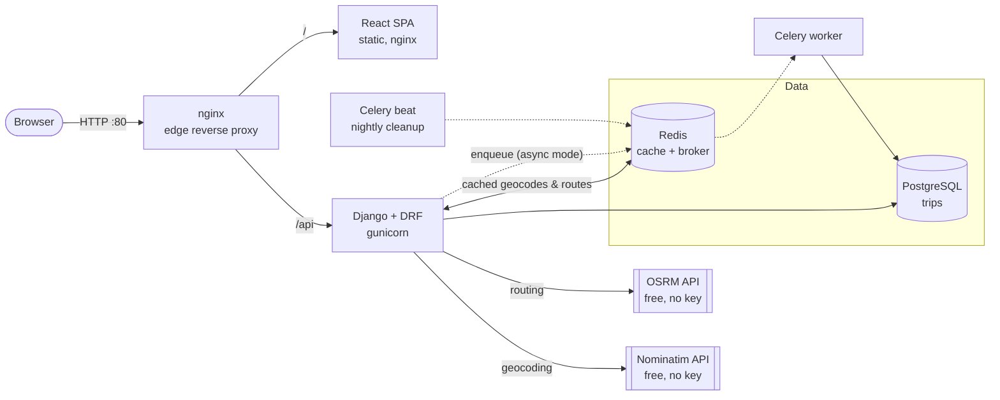
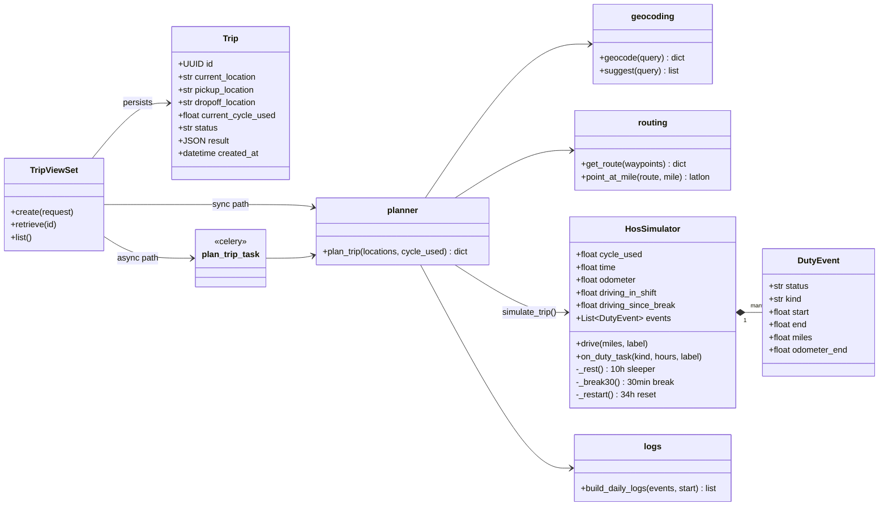
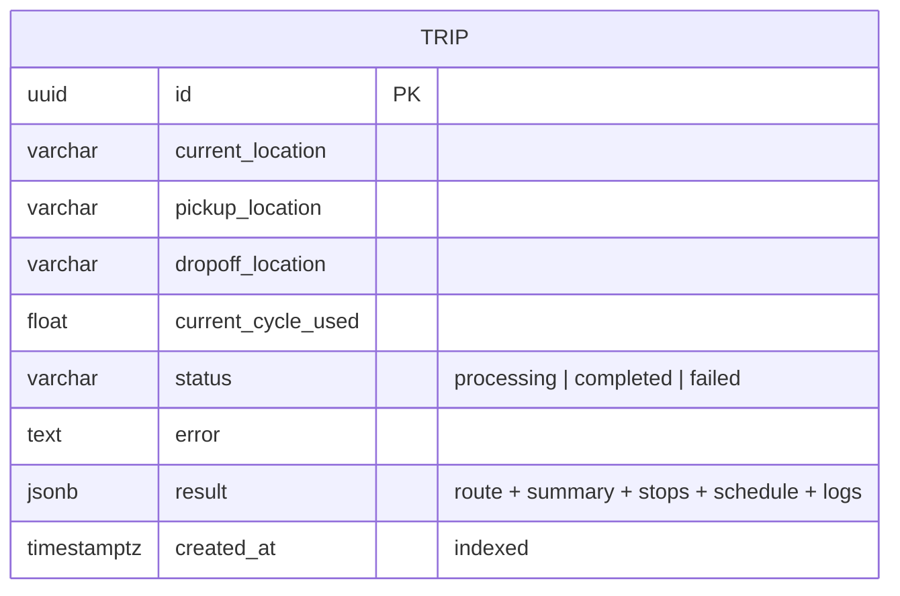
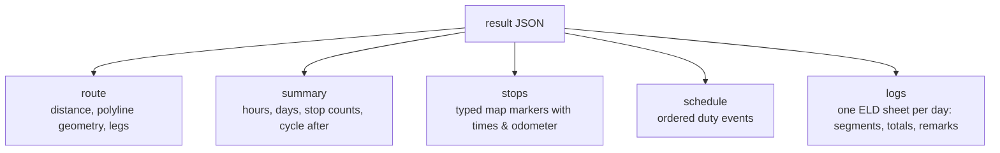

# RouteLedger — ELD Trip Planner 🚛 (Backend + Orchestration)

A full-stack application that takes a trip's details and produces **route instructions with every FMCSA-mandated stop** plus **auto-drawn Driver's Daily Log (ELD) sheets** — Django, React, PostgreSQL, Redis, Celery and nginx, fully containerized with Docker.

> **Live demo:** _add your EC2 URL here_
> **Loom walkthrough:** _add your Loom link here_

| Repo | Contents |
|---|---|
| **TruckDriverLog-Backend** (this repo) | Django + DRF API, HOS engine, Celery tasks, **docker-compose + edge nginx + deploy scripts** |
| [TruckDriverLog-Frontend](https://github.com/MahrukhMuzzamil/TruckDriverLog-Frontend) | React (Vite) SPA: map, itinerary, ELD log sheets, app tour |

---

## What it does

**Inputs:** current location · pickup location · drop-off location · current cycle used (hrs)

**Outputs:**

- 🗺️ Interactive map with the full route and markers for pickup, drop-off, **fuel stops (every 1,000 mi)**, **30-minute breaks**, **10-hour rests** and **34-hour restarts**
- 🕐 Hour-by-hour duty itinerary (exactly what an ELD would record)
- 📋 **FMCSA Driver's Daily Log sheets drawn automatically** — one per calendar day, with the stepped duty line, per-status totals, daily miles, remarks and the 70-hour recap. Print/PDF ready.

## Hours-of-Service rules implemented (49 CFR §395, property carrier)

| Rule | Implementation |
|---|---|
| 11-hour driving limit | Driving chunks capped per shift |
| 14-hour driving window | Window tracked from first on-duty task; no driving after it closes |
| 30-min break after 8h driving | Inserted automatically; any 30+ min non-driving period (incl. fueling/pickup) satisfies it |
| 10-hour off-duty reset | Taken in sleeper berth when driving/window limits are reached |
| 70-hour / 8-day cycle | Seeded from "current cycle used"; all on-duty time accumulates |
| 34-hour restart | Taken automatically when the cycle is exhausted mid-trip |
| Fueling every 1,000 miles | 30-min on-duty stop, placed on the route by odometer |
| Pickup / drop-off | 1 hour on-duty each |

Average highway speed is modeled at 55 mph for a loaded CMV; route distance comes from real road routing (OSRM).

## Architecture



**Why the API is fast:** geocoding results (30-day TTL) and road routes (7-day TTL) are cached in Redis, so repeated or similar trips are served in milliseconds without touching external services. The HOS simulation itself is pure in-memory computation (<1 ms). Celery handles background work — an async planning mode (`POST /api/trips/?mode=async`) and a nightly beat job that prunes stale trips.

## Core design — class diagram



## Database

A deliberately lean schema: inputs are columns, the computed plan is a single
JSON document written once and always read as a unit.



The `result` document embeds five sub-structures:



## Repo layout

```
config/              settings, urls, celery app
trips/
  models.py          Trip (inputs + JSON result)
  views.py           TripViewSet, geocode suggest, health
  tasks.py           plan_trip_task (async mode), cleanup_old_trips (beat)
  services/
    hos.py           ⭐ HOS simulation engine (pure, unit-tested)
    logs.py          timeline → per-day ELD log sheets
    planner.py       orchestrator: geocode → route → simulate → payload
    routing.py       OSRM client + Redis cache + point-at-mile interpolation
    geocoding.py     Nominatim client + Redis cache
  tests/             engine + log-splitting tests (12 tests)
docker-compose.yml   full stack (expects ../frontend cloned alongside)
nginx/               edge reverse proxy config
scripts/             infrastructure automation
```

## Running locally (Docker — recommended)

Clone the two repos side by side, then compose up from this repo:

```bash
mkdir TruckDriverLog && cd TruckDriverLog
git clone https://github.com/MahrukhMuzzamil/TruckDriverLog-Backend.git backend
git clone https://github.com/MahrukhMuzzamil/TruckDriverLog-Frontend.git frontend

cd backend
docker compose up --build
# → open http://localhost
```

<details>
<summary>Running without Docker (dev mode)</summary>

```bash
# backend (needs local Postgres + Redis, or export DATABASE_URL / REDIS_URL)
python -m venv .venv && source .venv/bin/activate
pip install -r requirements.txt
python manage.py migrate
python manage.py runserver            # http://localhost:8000
celery -A config worker -l info       # optional: async mode

# frontend (separate terminal, in ../frontend)
npm install && npm run dev            # http://localhost:5173, proxies /api
```
</details>

## Tests

```bash
python manage.py test trips
```

## API

| Endpoint | Description |
|---|---|
| `POST /api/trips/` | Plan a trip. Body: `current_location`, `pickup_location`, `dropoff_location`, `current_cycle_used` |
| `POST /api/trips/?mode=async` | Same, but queued on Celery; poll the trip until `status=completed` |
| `GET /api/trips/{id}/` | Retrieve a planned trip |
| `GET /api/trips/` | Recent trips (light summaries) |
| `GET /api/geocode/suggest/?q=chi` | Location autocomplete |
| `GET /api/health/` | Liveness + Redis check |

<details>
<summary>Example response shape</summary>

```json
{
  "id": "…",
  "status": "completed",
  "result": {
    "route":    { "distance_miles": 1043.7, "geometry": [[lat, lon], …], "legs": [...] },
    "summary":  { "driving_hours": 18.98, "days": 3, "fuel_stops": 1, "rest_periods": 1, ... },
    "stops":    [ { "type": "fuel", "lat": …, "lon": …, "arrival": "…", "odometer_miles": 1000 }, … ],
    "schedule": [ { "status": "driving", "start": "…", "end": "…", "miles": 440 }, … ],
    "logs":     [ { "date": "2025-06-02", "segments": [...], "totals": {...}, "miles": 605.2 }, … ]
  }
}
```
</details>

## Engineering notes

- **HOS engine is pure & unit-tested** — no I/O, deterministic, covered by tests for break insertion, daily limits, fuel cadence, cycle restart and mile conservation (`trips/tests/`).
- **Documented simplification:** instead of the rolling 8-day recap, the planner takes a 34-hour restart when the 70-hour cycle runs out mid-trip — always a legal, conservative choice.
- **12-factor config:** everything via environment variables; same image in dev and prod.
- **CI/CD:** GitHub Actions runs the test suite on every push and PR, and continuously deploys `main` to AWS (Docker Compose behind nginx).
- Non-root Docker user, healthchecked services, throttled API, consistent error envelope.
